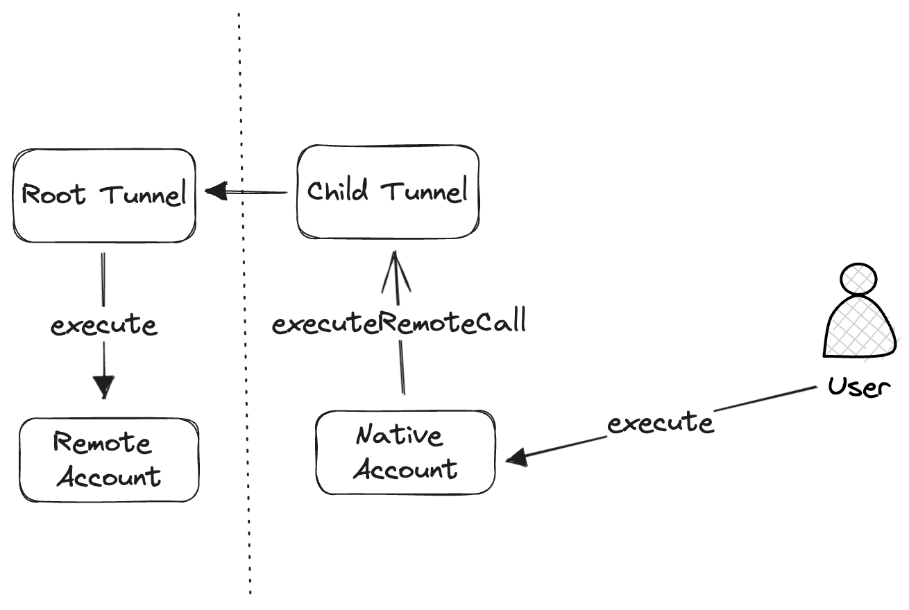

# erc6551-fx-portal

[`ERC6551Account`](https://eips.ethereum.org/EIPS/eip-6551) implementation
that allows users to operate accounts on remote chains using polygon
[`fx-portal`](https://github.com/0xPolygon/fx-portal/). The account on
the token chain is controlled directly, while accounts on all other chains
is controlled by the FxTunnel. Users can call `executeRemoteCall` on tunnels
that authenticates the user before sending the message for executing the call
on remote chain account.

